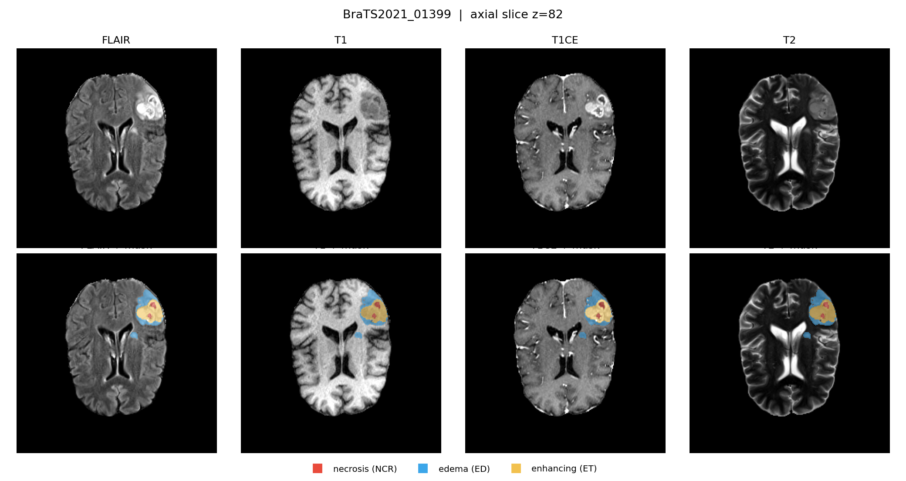
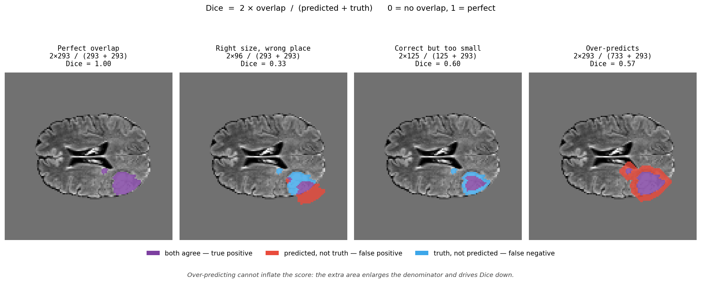

# Does synthetic MRI actually help brain tumour segmentation?

A controlled experiment on BraTS 2021, using a conditional diffusion model to impute the contrast-enhanced MRI scan (T1CE) and measuring whether synthetic data improves downstream tumour segmentation — and at what point it stops helping.

## Background

A human body is mostly water and fat, so it is full of hydrogen atoms. A **Magnetic Resonance Imaging** (MRI) scanner aligns them with a strong magnetic field, knocks them out of alignment with a radio pulse, and listens as they relax back.

The machine doesn't take just one picture. It can take several, and each one makes different tissues look bright or dark — same patient, same session, same machine.

Different tissues have different T1 and T2 relaxation properties. MRI acquisition parameters are chosen to emphasize these differences, producing different tissue contrasts.

- **T1** — how fast they realign with the magnetic field
- **T2** — how fast they fall out of sync with each other

Both are properties of the tissue, measured in milliseconds. Listening at a time that highlights the first gives a *T1-weighted image*; the second gives a *T2-weighted image*.

### The four images

Each patient has four **co-registered MRI modalities**: T1, T1CE, T2 and FLAIR. Each highlights different properties of the brain and tumour.

| Scan | What it emphasizes | What's bright | Spot it by |
|---|---|---|---|
| **T1** | Brain anatomy | Fat / white matter | Clear anatomical structure; CSF is dark |
| **T2** | Water-rich tissue | Water / CSF | Fluid and many abnormalities appear bright |
| **FLAIR** | Abnormal water while suppressing CSF | Edema / tumour-related abnormalities | CSF is dark, while edema often appears bright |
| **T1CE** | Contrast enhancement | Contrast-enhancing tissue | Bright enhancing regions that are less visible on T1 |

- **FLAIR** is based on T2-weighted imaging but suppresses the signal from normal CSF. This makes abnormal water, such as **tumour-associated edema**, easier to see.

- **T1CE** is a T1-weighted scan acquired after **gadolinium contrast**. Where the blood-brain barrier is disrupted, contrast can enter the tissue and produce **bright enhancement**.

Here they are for one patient:



*Top row: the four images, same patient, same slice. Bottom row: the same images with the expert outline drawn on.*

When we compare **T1** and **T1CE**, they show the same patient's anatomy, but T1CE additionally highlights regions where the contrast agent has entered the tissue. The only difference is the dye injection, and **bright contrast-enhancing regions** can appear.

## Goals of the Project

**1. One of the goals of this project is to generate the contrast-enhancing regions visible on T1CE.** T1CE requires a gadolinium injection and additional imaging, and contrast administration is not suitable for every patient. That's why T1CE is the image this project tries to generate.

**2. The other goal of this project is to measure whether generated T1CE images are actually useful**, not just convincing, by training a tumour-finding model twice - once on real data alone, once on real data plus generated T1CE - and comparing the Dice scores.

**3. And the final goal is to find where synthetic data stops helping.** The comparison is run at five dataset sizes — 25, 50, 100, 250 and 951 patients. Synthetic data should matter most when real data is scarce and matter less once there is plenty; the aim is to locate that crossover point. The deliverable is one graph with two lines, and the point where they meet.

**Research question:**  
Does synthetic T1CE improve tumour segmentation, and does its benefit decrease as more real training data becomes available?

## Dataset

**BraTS 2021**, from [The Cancer Imaging Archive](https://doi.org/10.7937/jc8x-9874),
CC BY 4.0. 1,251 patients, Each patient has four co-registered MRI modalities and expert tumour segmentation labels, at 240 × 240 × 155 and 1 mm resolution.

Chosen because the four images are already aligned to each other and stripped of
facial features. Lining up scans of the same patient is a hard problem in itself,
and BraTS has already solved it - which leaves this project free to work on the
actual question.

The scans come from eight institutions, the largest being UPENN-GBM (403),
new-not-previously-in-TCIA (351), and UCSF-PDGM (263). The five smallest, totalling
234 patients, are pooled together when balancing splits - you cannot balance a
group of four across seven splits.


## Methodology

So now the task is to train a model that draws the tumour outline by itself, given the images. And to score it, we compare the shape that the model drew against the expert's and measure how much they overlap. That overlap score is called **Dice**: 0 means no overlap at all, 1 means a perfect match.

### Dice explanation



*Purple = both agree. Red = the model said tumour, but it isn't. Blue = it is tumour, but the model missed it.*

Two things worth noticing:

- Getting the right *size* in the wrong *place* still scores badly — matching the area is worth nothing without actually overlapping
- Guessing "tumour everywhere" doesn't work either. All that extra red counts against the score

Overlap is used instead of simple accuracy because tumour is less than 1% of a scan. A model that says "no tumour anywhere" is right 99% of the time and completely useless — accuracy rewards it, Dice gives it a zero.


### Splits

Split by **patient**, not by images - slices of the same person appearing in both training and testing would let the model score well by recognising the patient rather than by finding tumours.

- **200** patients held out for testing, untouched until the end
- **100** for tuning decisions along the way
- **951** left as the training pool

The five training sets are drawn from that pool. They are **nested**, so going from 25 to 50 means "add 25 more patients" rather than "draw a different random 50" — otherwise the results would wobble because of *which* patients got picked, not how many. They are also **balanced across the eight contributing hospitals**, so a machine mismatch can't masquerade as a data-quantity effect.

### Preprocessing

Rescale each image against itself, since MRI brightness values have no fixed meaning — one patient's scan can span thirty times the range of another's. Keep only the roughly 61 of 155 slices that contain tumour. Shrink to 128×128.

### Generating the T1CE

A **diffusion model** - the family behind image generators like Stable Diffusion. It learns by having noise added to real images until they are pure static, then learning to reverse that process.


Here it isn't generating freely. It is given the other three MRI modalities and asked to produce the corresponding T1CE:

```text
FLAIR + T1 + T2
       ↓
Conditional diffusion model
       ↓
Generated T1CE
```

The three real images pin down the anatomy, so the generator only has to work out what the dye would have shown. Built with [MONAI](https://project-monai.github.io/), a medical-imaging library for PyTorch. The tumour-finder itself is a **U-Net**, the standard architecture for outlining structures in medical images.

### Overall pipeline

The complete experiment can be summarized as:

```text
T1 + T2 + FLAIR
        ↓
Conditional diffusion model
        ↓
Synthetic T1CE
        ↓
Tumour segmentation
        ↓
Dice score
        ↓
Compare with real-T1CE baseline
        ↓
Repeat at 25 / 50 / 100 / 250 / 951 patients
```

## Citation

This project uses the BraTS 2021 dataset:

- Baid, U. et al. (2021). *The RSNA-ASNR-MICCAI BraTS 2021 Benchmark on Brain Tumor
  Segmentation and Radiogenomic Classification.* arXiv:2107.02314
- Menze, B. H. et al. (2015). *The Multimodal Brain Tumor Image Segmentation
  Benchmark (BRATS).* IEEE TMI, 34(10), 1993–2024
- Bakas, S. et al. (2017). *Advancing The Cancer Genome Atlas glioma MRI collections
  with expert segmentation labels and radiomic features.* Scientific Data, 4, 170117
- Baid, U. et al. (2021). *RSNA-ASNR-MICCAI-BraTS-2021* [Data set]. The Cancer
  Imaging Archive. DOI: 10.7937/jc8x-9874